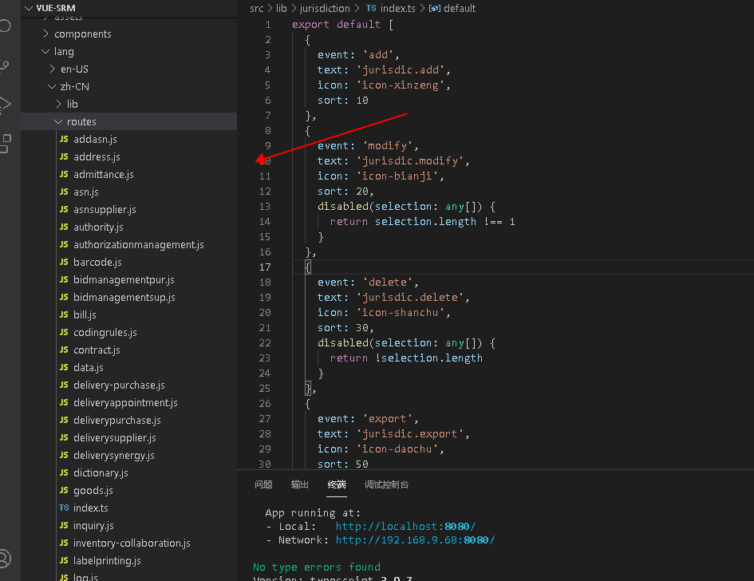
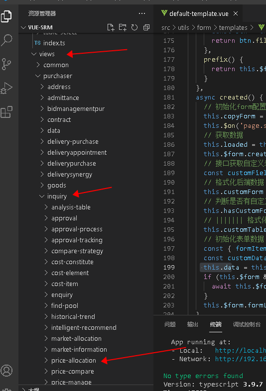
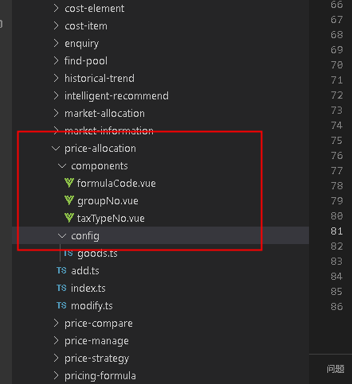
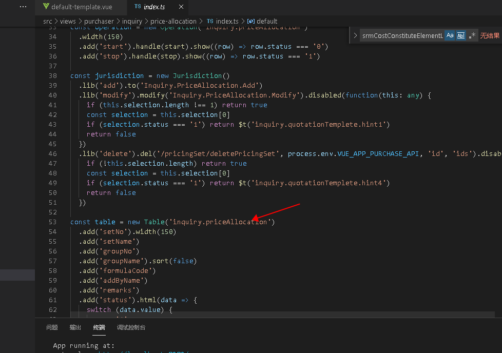
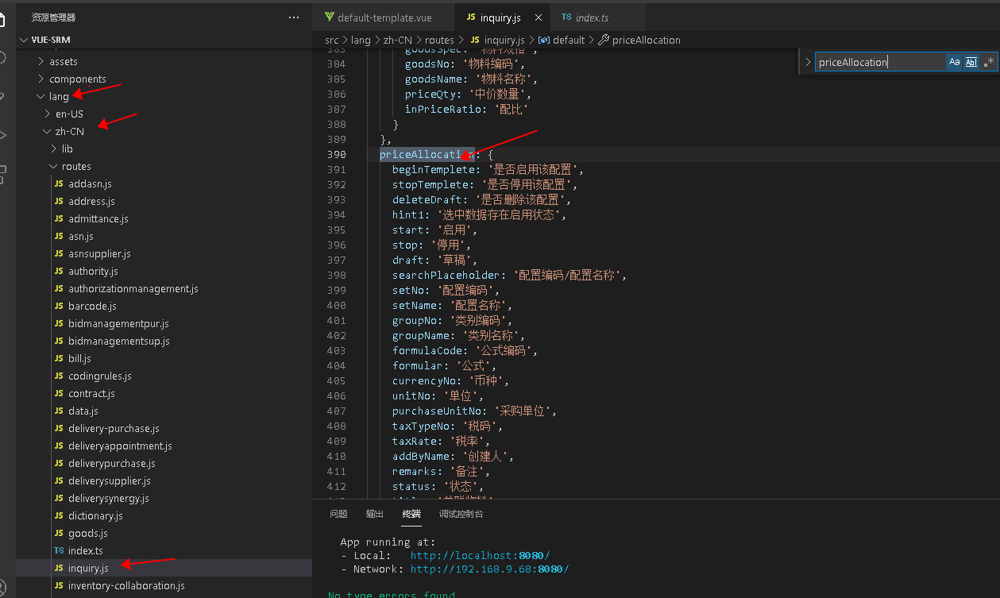
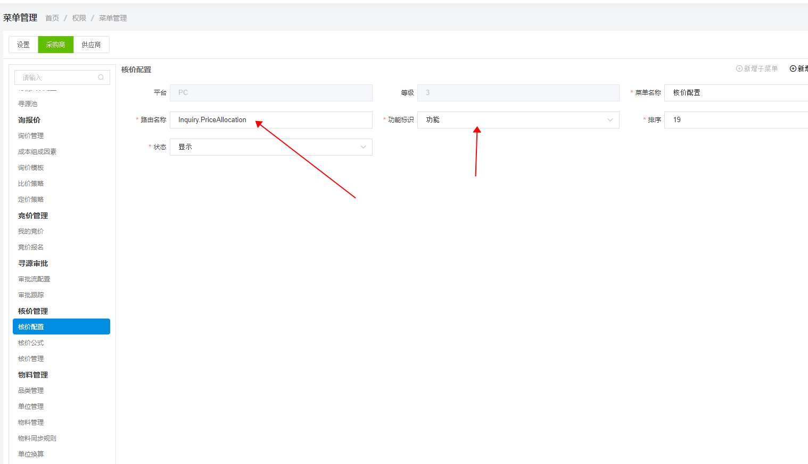

# 起步

##  目录结构
src文件下
- api
  - 与后端交互的api方法 （接口）
- components
  - 公共组件
- lang 国际化配置
  - 使用 zh-CN
  
- lib options select 配置
- routes vue-router 路由配置
- views 所有的路由文件
  - purchaser 采购商 目录
  - supper 供应商目录
  - setting 设置界面
- app.vue 路由组件的顶级路由
- main.js vue 入口文件
- 环境变量配置 .env.development(测试环境地址配置) 变更配置要重启服务

## 页面查找
以核价配置为列 页面链接 （http://localhost:8080/purchaser/inquiry/price-allocation）
从views 路由文件 到 purchaser 采购商文件夹 到inquiry 文件夹 到price-allocation 核价配置目录



目录结构
- index.ts (列表页)  
- add.ts（新增页面）
- modify （修改页面）
- components (自定义组件适应于复杂页面)
- config （配置项 常用函数和详情页面可以放这里）



## 国际化查找
以核价配置为列 inquiry.priceAllocation 到 /src/zh_CN/routes/inqury下面(图4)




## 路由设置
在目录结构中  routes 文件夹里面配置

1 在已有配置下配置路由 以核价配置为列 
router name(命名路由   当前路由的名称)   path (对应当前路由的路径)

核价配置在inqury文件下 到对应的  routes -> purchaser ->  inqury
```ts
    {
      path: 'price-allocation',
      name: 'Inquiry.PriceAllocation',
      meta: {},
      component: () => import(/* webpackChunkName: "inquiry" */ '@/views/purchaser/inquiry/price-allocation/index.ts')
    },
    {
      path: 'price-allocation/add',
      name: 'Inquiry.PriceAllocation.Add',
      meta: { title: 'common.add', dep: 'Inquiry.PriceAllocation' },
      component: () => import(/* webpackChunkName: "inquiry" */ '@/views/purchaser/inquiry/price-allocation/add.ts')
    },
    {
      path: 'price-allocation/modify/:id',
      name: 'Inquiry.PriceAllocation.Modify',
      meta: { title: 'common.modify', dep: 'Inquiry.PriceAllocation' },
      component: () => import(/* webpackChunkName: "inquiry" */ '@/views/purchaser/inquiry/price-allocation/modify.ts')
    },
```
## 菜单配置
菜单路径： http://localhost:8080/setting/authority/sysmenu
以核价配置为例
路由名称： 对应核价配置列表页的name （只需要配置列表的路由）

功能标识： 默认功能
```ts
    {
      path: 'price-allocation',
      name: 'Inquiry.PriceAllocation',
      meta: {},
      component: () => import(/* webpackChunkName: "inquiry" */ '@/views/purchaser/inquiry/price-allocation/index.ts')
    },
```


## 

  
