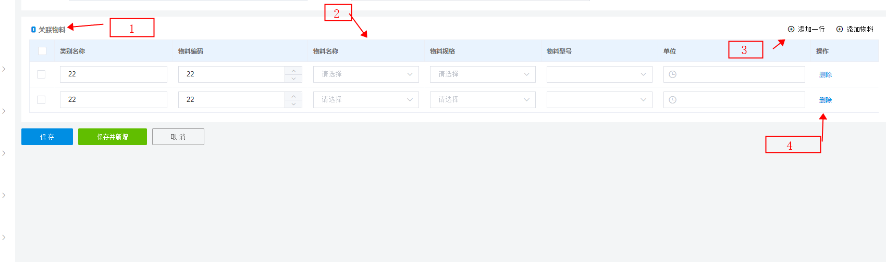
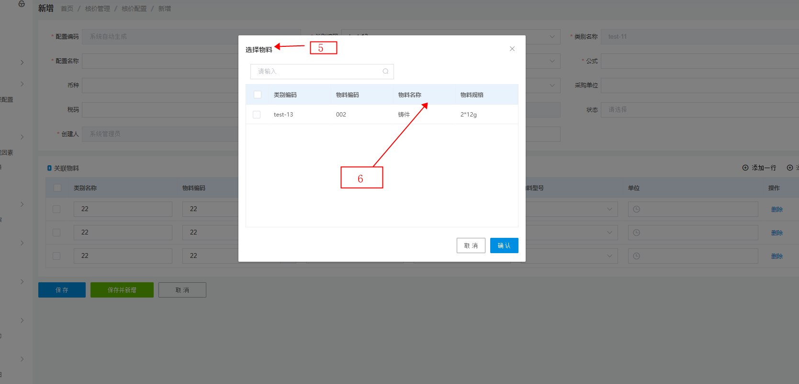

# tabSelect模块

## tabSelect 

- tabSelect介绍
  - type 参数  默认写page  none不开启弹窗
  - url 弹窗搜素接口链接  支持function
  - jurisdiction 右侧操作栏 参照下图 (3)
  - operation 列表的操作按钮 参照下图 (4)
  - title  参照下图 (1)
  - dialogTitle 弹出窗标题  参照下图 (5)
  - table 列表 参照下图 (2)
  - dialogTable 弹出窗列表 参照下图 (6)
  - filter 过滤数据
 
 
 

``` ts
const tableSelect = new TableSelect('inquiry.priceAllocation')
  .type('page')
  .url(api)
  .jurisdiction(jurisdiction)
  .operation(operation)
  .title('title')
  .dialogTitle('selectGoodsTitle').width('600px')
  .table(table)
  .dialogTable(dialogTable)
  .filter(filter)

```

完整tabselct

```ts
import Table from '@utils/table'
import TableSelect from '@utils/table-select'
import http from '@/plugin/axios'
import Operation from '@utils/common/operation'
const { Jurisdiction } = TableSelect

// 过滤参数
function filter(selection: any[], value: any[]) {
  const data = []
  const ids: string[] = []
  value.forEach(item => {
    data.push(item)
    ids.push(item.goodsNo)
  })
  return selection.filter(item => !ids.includes(item.goodsNo)).map(item => {
    return {
      ...item,
      goodsNo: item.itemNo,
      goodsName: item.itemName,
      spec: item.itemSpec
    }
  })
}

function remove(this: any, row: any, index: number) {
  const value = [...this.value]
  value.splice(index, 1)
  this.$emit('input', value)
}

function addGood(this: any, vm: any) {
  console.log(this)
  if (!this.data.groupNo) {
    return this.$message({
      message: this.$t('inquiry.priceAllocation.tips1'),
      type: 'warning'
    })
  }
  const other = vm.$jurisdiction && vm.$jurisdiction._list.vm
  other && other.add()
}

function addLine(this: any, vm: any) {
  const item = {
    groupName: '22',
    goodsNo: '22',
    goodsName: '',
    spec: '',
    model: '',
    unitNo: ''
  }
  // console.log(this.data.bodyList.push(item))
  this.data.bodyList = [...this.data.bodyList, item] // data 代表当前所有的参数值   data.bodyList bodyList指的是当前table所绑定的参数名称
}

const jurisdiction = new Jurisdiction('inquiry.priceAllocation')
  .lib('add').text('addGood').handle(addGood)   // 有前置条件
  .lib('add').text('addBatchGoods').emit('add') // 无前置条件 快捷触发vue实例事件
  .add('add').handle(addLine).icon('icon-join') // 添加一行

const dialogTable = new Table('inquiry.priceAllocation')
  .add('groupNo')
  .add('goodsNo').name('itemNo')
  .add('goodsName').name('itemName')
  .add('spec').name('itemSpec')
  .add('model')
  .add('unitNo')

const table = new Table('inquiry.priceAllocation', true)
  .type('selection')
  .sortable(false)
  .add('groupName')
  .add('goodsNo')
  .add('goodsName')
  .add('spec')
  .add('model')
  .add('unitNo').label('unitNos')

const operation = new Operation()
  .add('release').label('common.remove').handle(remove)

function api(this: any, data: any) {
  const params = {
    ...data,
    condition: {
      ...data.condition,
      groupNo: this.vm.data.groupNo,
      statusCode: '1'
    }
  }
  return http({
    url: '/bmItem/getBmItemPage',
    baseURL: process.env.VUE_APP_PURCHASE_API,
    data: params
  })
}

const tableSelect = new TableSelect('inquiry.priceAllocation')
  .type('page')
  .jurisdiction(jurisdiction)
  .url(api)
  .title('title')
  .dialogTitle('selectGoodsTitle').width('600px')
  .table(table)
  .operation(operation)
  .dialogTable(dialogTable)
  .filter(filter)

export default tableSelect


// 表单页
export default new Form('inquiry.priceAllocation')
  .name('Inquiry.PriceAllocation.Add')
  .table('bodyList', goods)
  .end()

```

## table开启 编辑
.edit true开启table编辑

``` ts

const table = new Table('inquiry.priceAllocation', true)
  .edit(true)

```

```ts
// 普通输入框
const table = new Table('inquiry.priceAllocation', true)
  .edit(true)
  .add('groupName').editor('el-input')

```

```ts
// InputNumber 计数器 width 组件宽度
const table = new Table('inquiry.priceAllocation', true)
  .edit(true)
  .add('goodsNo').editor('el-input-number').attrs({ controlsPosition: 'right', min: 0 }).width(150)

```

```ts
// 日期选择器

const table = new Table('inquiry.priceAllocation', true)
  .edit(true)
  .add('unitNo').editor('el-date-picker').width(170).bind('type', 'datetime')

```

```ts
// 枚举值下拉框
import OptionsSelect from '@/components/select/options-select/options-select.vue'

const inquirySelect = {
  _useUrl: true,
  mapKey: 'sourceTypeName' // 枚举值名称 对应enumMid 需要的值
}
const table = new Table('inquiry.priceAllocation', true)
  .edit(true)
  .add('goodsName').editor({ component: OptionsSelect }).bind('_options', inquirySelect)

```

```ts
// 远程搜索下拉框
import SearchSelectForm from '@/components/select/search-select-form/search-select-form.vue'
import Select from '@utils/common/select'
const select = Select.use('/srmFactory/getFactoryPage').params({ usingFlag: '1' })

const table = new Table('inquiry.priceAllocation', true)
  .edit(true)
  .add('model').editor({ component: SearchSelectForm, _select: select, lazyLoad: true })

```
